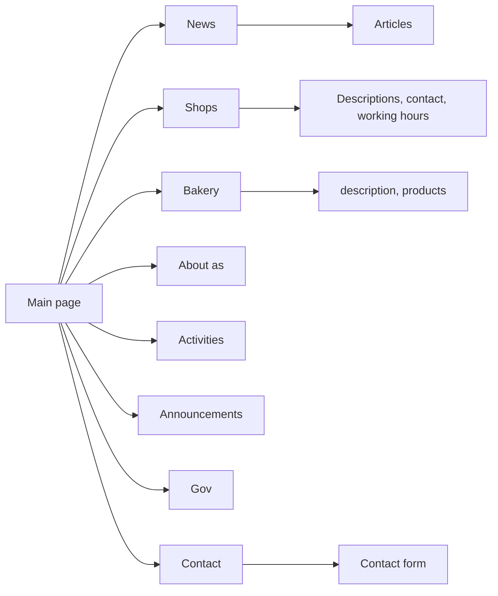
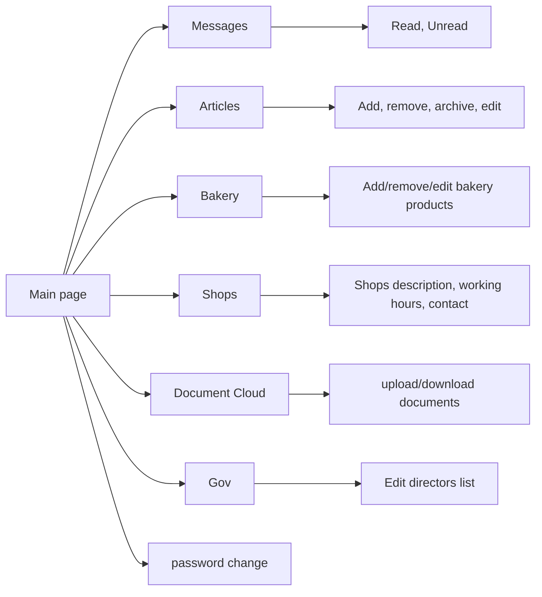
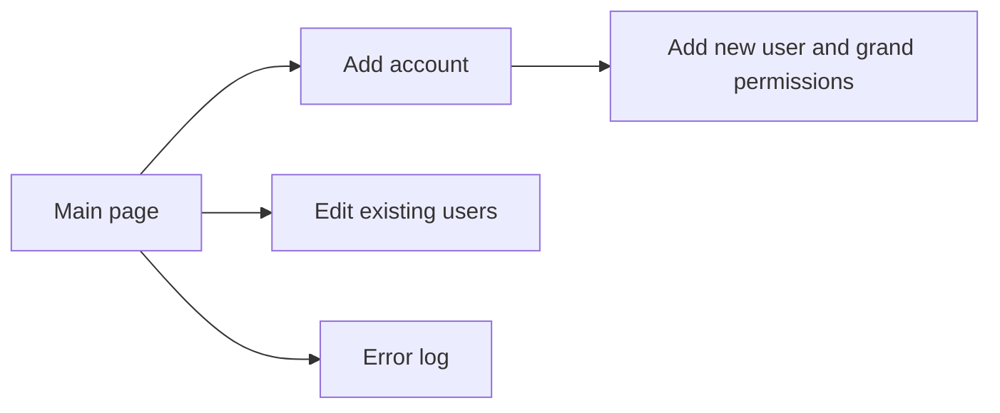

# Official GSSCH company service
This application is official GSSCH service which is used to show all important information related to company activity. 

## About app
Program gives ability to public news and announcements by company administrator. Also admin can changes data and photos about all company shops and directors list . Bakery tab have additional options to add a bakery products with photos. Clients can use special form to contact with company.
### Users management
Administrator can create additional accounts for workers and grand permissions. They can read messages from clients, edit a content and use special document store. Also there is possibility to read and clear error log and remove accounts. Application informing administrator and workers how much space left on server for articles and documents.

## Application map

### Client side page

### Workers side page

### Admin page

## Technologies
This application was made with express.js written in javaScript. In front-end there is pseudo
single page application written in vanilla.js. Data are stored on remote noSql database MongoDB. 
Additional technologies used in this project:
- bcrypt
- cookie parser
- cookie session
- mongoose
- multer
- express rate limiter
- exxpress async errors

## Languages

Service interface is in Polish

## How to start ?

To start this app at first you need to install all required node modules by node package manager:
- npm install
Next step is to complete data at config.js file:
- db
> add path to remote database in MongoDB
- keySession: ['key example'],
> add your key for session
- maxAgeSession
> write how long should last the session 
- algorithm
> coding algorithm for example  'aes-192-cbc'
- iterations
> coding iterations
- salt
> salt for coding
- password
> your secret password for coding
### Store space adjusting
To adjust how much space you want to give for document and article store use limitconfig.js file:
- contentLimit
> how much space articles can take on server: in bites
- databaseLimit
> how much space you want to let for documents cloud
### Starting application
To start app use www.js file in bin folder and start it by node:
- node www.js

## Contact
To reach me use my email address: pileckidariusz90@gmail.com

## Copyrights
All rights to this program are for "GSSCH Komańcza" company
## Site
You can reach working application on: https://www.komanczagssch.pl
